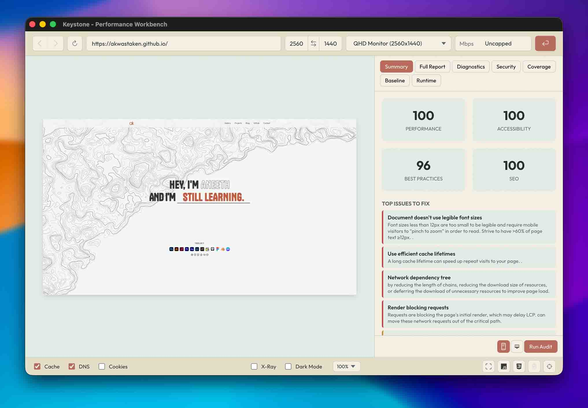
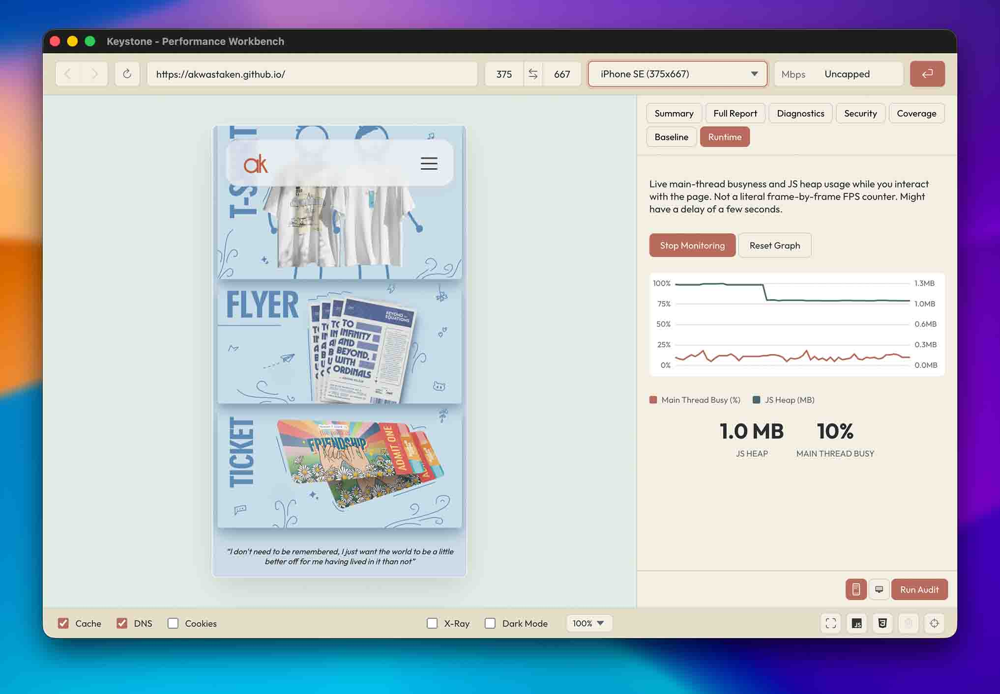

A desktop performance workbench built in Electron. Keystone gives you a controllable browser window with device emulation, network throttling, and cache/cookie control, plus a full built-in reporting suite so you don't have to bounce between five different websites and paywalled tools to understand how a page actually performs.

Everything runs locally on your machine. Nothing is sent to a third-party server to generate these reports.

---

## What it does

### The browser workbench

* **Device emulation** with presets for common phones, tablets, and monitors, or a custom width and height of your own.
* **Network throttling** with Fast 3G, Slow 3G, offline, and custom Mbps profiles, applied through the same protocol Chrome DevTools uses internally.
* **Cache, DNS, and cookie control** so you can choose exactly what carries over between page loads, useful for testing a genuine first-time visitor experience versus a returning one.
* **JavaScript and CSS toggles** to see what a page looks like and how it behaves with either one turned off.
* **X-Ray mode** to outline every element on the page, and a **dark mode override** independent of the site's own theme.
* **Screenshot capture**, saved straight to your Pictures folder.
* **Native DevTools** access for the loaded page, one click away.

### The Reports panel

Click the report icon in the dock to open a side panel with the following tabs:

* **Summary** - Performance, Accessibility, Best Practices, and SEO scores at a glance, along with a plain list of the biggest issues found and why they matter.
* **Full Report** - A preview of the top opportunities for improvement, with a button to open the complete, official Lighthouse report in its own window, at full size, rather than squeezed into a side panel.
* **Diagnostics** - Runs the same page twice in sequence, once against a completely empty cache and once with a warm one, and shows the real measured difference caching makes to load time and Core Web Vitals. This isn't a hypothetical estimate; it's two real audits, diffed.
* **Security** - A passive check of the page's response headers and negotiated protocol: whether HTTPS is enforced, whether HSTS and a Content-Security-Policy are present, and a handful of other headers that commonly get missed. This is a configuration check, not a vulnerability scanner, and doesn't claim to be one.
* **Coverage** - Uses Chromium's own code coverage instrumentation to report exactly how many bytes of downloaded JavaScript and CSS were never executed during page load, sorted by wasted weight. Directly useful for deciding what to code-split or tree-shake.
* **Baseline** - Runs the same performance audit across your current page and up to two additional URLs, side by side, in one pass. Built for comparing a staging build against production, or your own site against a competitor's, with actual numbers instead of a gut feeling.
* **Runtime** - A live chart of main-thread activity and JS heap usage while you interact with the page after it's already loaded. Lighthouse only measures what happens during initial load; this catches jank and memory growth caused by scrolling, opening modals, or anything else that happens afterward.

---

## How it works & Development Process

Keystone uses Electron's `<webview>` tag as the browser surface you interact with, and talks to it directly over the Chrome DevTools Protocol for throttling and cache control.

For anything that runs a full audit (Summary, Diagnostics, Security, Coverage, Baseline), Keystone launches a separate, temporary instance of [chrome-headless-shell](https://developer.chrome.com/blog/chrome-headless-shell) in the background. This is a stripped-down, headless-only build of Chromium made for exactly this kind of automation. It's used instead of a full Chrome install so nothing has to already be on your system for these reports to work, and instead of a full Chromium download so the app stays as light as it reasonably can. Each audit closes its browser instance when it's done.

Everything is built on Google's own [Lighthouse](https://developer.chrome.com/docs/lighthouse/overview) engine underneath, the same one that powers [PageSpeed Insights](https://pagespeed.web.dev). Keystone doesn't reimplement any of that scoring logic. It just gives you a nicer, unified place to run it, without hitting a paywall or a request limit.

### Behind the Scenes
Keystone is a passion project I built out of real-world friction. Here is a breakdown of how it was designed and put together:
* **Frontend & Architecture:** The visual interface, layout mechanics, user workflows, were built, customized, and styled entirely by me to create a focused, distraction-free developing environment. 
* **Backend & System Automation (AI Assisted):** Since JavaScript and Node.js are not my fluent primary languages, the complex backend, sequential state cleanup functions, and low-level Chromium Debugger Protocol (CDP) API hooks were heavily Claude-assisted.

---

## Installation, Setup & Building

Looking to install, run, or build Keystone for your system? 

All documentation covering installation prerequisites, multi-platform setup steps (macOS, Windows, and Linux), manual native compilation steps, and standalone installer packaging using Electron Forge has been moved to the repo wiki.

To be transparent, I only compiled it on macOS, and I am pretty sure the app will compile without any issues on all kernels.

**[Check out the Wiki for full Installation and Build Guides](https://github.com/AKwasTaken/keystone/wiki)**

### Lightweight hassle-free MacOS install

1. Download the [latest release](https://github.com/AKwasTaken/keystone/releases/tag/v1.0.0) from the releases section.
2. Mount the DMG by double clicking on the file.
3. Drag the App Icon to the `Applications` folder.

---

## License

This project is licensed under the MIT License. See the [LICENSE](LICENSE) file for more details.
